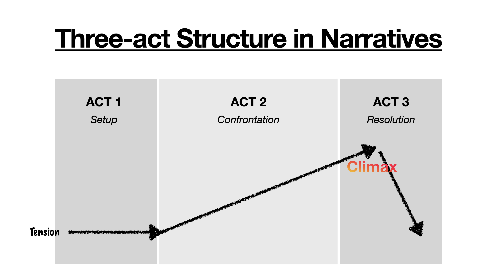
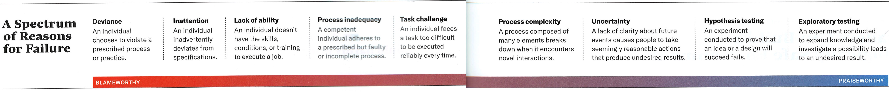

<!-- # Execution Handbook -->

## Table of Contents

1. [Prologue](#prologue)
2. [Building Trust](#building-trust)
3. [Roadmapping](#roadmapping)
4. [Storytelling](#storytelling)
5. [Hiring](#hiring)
6. [Building a Product and Running R&D](#building-a-product-and-running-rd)
7. [How to Sell](#how-to-sell)
8. [How to Welcome Customers](#how-to-welcome-customers)
9. [Growing Together With Your Team](#growing-together-with-your-team)

## Prologue
I've led multiple teams in my tech career, and the same questions come up again and again:

- How do you design a roadmap and track progress?
- How do you manage expectations up, sideways and down?
- How do you build a team from scratch?

I wrote this handbook to organize my answers, so they're easier to pass on. Alongside my own thoughts, I've included the books, articles, lectures, and interviews that helped me form my thoughts. 

I didn't write this handbook for strangers on the Internet. I wrote this for my friends—to help you, and to enrich our conversations. 

## Building Trust
Before you can execute anything—at work or with friends—you need to trust. How do you earn it? Every situation is different, but here are three principles that have worked for me:

1. **Be competent (Logic)**. Everyone trusts people who get things done. There are three elements of competency: _technical_ knowledge, _operational/practical_ knowledge, and _political_ knowledge. Balance those three every quarter.
2. **Care about your teams (Empathy)**. What makes them excited and scared? What are their boundaries? Am I helping them getting them what they want? If you take care of this part, you will read the room better.
3. **Let your teams experience the _real you_ (Authenticity)**. So many people aren't even aware of this part. I didn't either until my mentor said that you should share your feelings and emotions with your colleagues. Otherwise people can't trust you as a person. This also means that you need to be willing to openly share your vulnerabilities. This takes time and requires good culture in your organization. If you understand your teams well, you know how much open you can be with your teams about your feelings and emotions.

### Materials
- [Book: Beyond Entrepreneurship](https://www.goodreads.com/book/show/55270310-be-2-0-beyond-entrepreneurship-2-0)
- [HBR: Begin with Trust](https://hbr.org/2020/05/begin-with-trust)
- [HBR: Decision to trust](https://hbr.org/2006/09/the-decision-to-trust)
- [HBR: Enemies of trust](https://hbr.org/2003/02/the-enemies-of-trust)
- [HBR: Fair Process: Managing in the Knowledge Economy](https://hbr.org/2003/01/fair-process-managing-in-the-knowledge-economy)
- [HBR: To Build Trust, Competence is Key](https://hbr.org/2012/03/to-build-trust-competence-is-k)
- [HBR: For People to Trust You, Reveal Your Intentions](https://hbr.org/2012/04/for-people-to-trust-you-reveal)
- [HBR: Proven Ways to Earn Your Employees’ Trust](https://hbr.org/2014/06/proven-ways-to-earn-your-employees-trust)
- [HBR: What’s the Best Way to Build Trust at Work?](https://hbr.org/2021/06/whats-the-best-way-to-build-trust-at-work)

## Roadmapping
I like to update the roadmap before every release. Depending on the product and company, release cycles can be daily, weekly, monthly, or quarterly. I keep a 12-month rolling window, so we always know where we should be in 12 months. It's crucial that you inform your stakeholders that anything beyond 6 months will likely change. In my experience, it always does.

Here's how I build the roadmap with my stakeholders:
1. **Start with the customers**. What are their pain points? Why are those painful? Why do those exist? Why do they matter? How much would customers be willing to pay to address those pain points? Look for patterns.
2. **Listen to your stakeholders**. Talk to Engineering, Product, Design, Sales, Customer Success, and the Board. What do the metrics and indicators say? What have we learned from using the products ourselves?
3. **Understand your market**. What trends are shaping your industry? How have your customers—and their customers—evolved? What drives decision-makers? 
4. **Know your competition**.
5. **Review your business model**.
6. **Understand your runway/budget**. How much time and money do we have?
7. **Draft the roadmap**. Spot patterns and opportunities from the data you’ve gathered. Balance short- and long-term objectives. Do this part with as few people as possible to move fast. This is the part where you have to follow your intuition.
8. **Draft a release note**. Based on your roadmap, outline what you'll ship and their impacts. Your release note should answer why your customers should care about it. Are the value propositions clear? Do they serve real customer needs? Does the cadence match your budget and board expectations?
9. **Get feedback**. Listen and adjust.
10. **Finalize the roadmap and release note. Then share widely**. 

### Materials
- [Book: The Product Manager's Handbook by Linda Gorchels](https://www.goodreads.com/book/show/19173996)
- [Book: Positioning by Al Ries, Jack Trout](https://www.goodreads.com/book/show/760025.Positioning)
- [Book: Thinking, Fast and Slow by Daniel Kahneman](https://www.goodreads.com/book/show/11468377-thinking-fast-and-slow)
- [Book: HBR Guide to Thinking Strategically](https://www.goodreads.com/book/show/40710184-hbr-guide-to-thinking-strategically)
- [Stanford GSB: Jensen Huang, Founder and CEO of NVIDIA](https://youtu.be/lXLBTBBil2U)

## Storytelling
Storytelling may sound outside your domain—but it is essential in every aspect of our work and lives. Engineers, designers, salespeople, lawyers, managers, recruiters, interviewees, parents, and kids all use it. It's especially critical in leadership, product management, R&D, and sales.

The good news? Everyone knows what a good story _feels_ like. That means anyone can learn to tell one. 

### Why storytelling matters
We don't exist alone. In our professional lives, we have teams, partners, and customers. In our personal lives, we share our lives with friends and family. 
To get what we want—approval for an idea, a promotion, a sale, an investment, even a relationship—we need to persuade. That means competing for attention, time, and resources, often against other people's priorities.

So how do you convince someone to choose you or your idea? You tell a compelling story that combines the three core elements: logic, people, and emotion,

### What is storytelling?
Think of the Bible, Greek/Roman Myths, Shakespeare, superhero movies, Apple Keynotes, or election campaigns. They're all stories. And they're all examples of storytelling. 

Here's how I define it:

- A story is the content—the arc, characters, and message.
- Storytelling is the full experience your audience goes through: what they expect, how they feel during it, and how they react afterward.

The same story can feel completely different depending on the time, place, occasion, or speaker. Great storytellers control the entire journey.

### How to tell a story?
Here is my framework:
1. Who is the audience? What do they care about? What context might they be missing? Different groups bring different assumptions.
2. Why this story? Why should people care about it? What's at stake?
3. What is the heart of the story? What emotion do you want them to feel? What reactions do you want them to do afterward?
4. How can I tell this story authentically? Be yourself. Don't try to be someone else.
5. When is the right time to tell the story? Timing shapes impact. Even a great story can fall flat if told too soon or too late.

For me, the easiest place to start is the audience. When I understand their view, I know what to include and exclude in the story. Good stories leave out everything that doesn't matter. Less is more.

### You already know what good storytelling feels like
We consume stories all the time—on Netflix, YouTube, Twitter, podcasts, books, and music. Next time you enjoy one, ask yourself:
- What emotions did it spark?
- What worked? What didn’t?
- Why did it stick with you?

Then try those same techniques yourself.

Most good stories follow familiar patterns: the three-act structure in the West, or 기승전결/起承転結 in East Asia. Try shaping your story with these patterns.

### Materials
- [YouTube: How to Speak by Patrick Winston](https://youtu.be/Unzc731iCUY)
- [YouTube: Story Telling In Business by Mathew Luhn at Pixar](https://youtu.be/HYQOW34b-0g)
- [YouTube: The clues to a great story by Andrew Stanton at Pixar](https://youtu.be/KxDwieKpawg)
- [J.K. Rowling on writing](https://www.jkrowling.com/on-writing/)
- [Book: Influence by Robert B. Cialdini](https://www.goodreads.com/book/show/28815.Influence)
- [HBR Guide to Better Business Writing](https://www.goodreads.com/book/show/13586939-hbr-guide-to-better-business-writing)
- [Google Technical Writing Courses](https://developers.google.com/tech-writing)
- [Apple Style Guide](https://support.apple.com/guide/applestyleguide/welcome/web)
- [HBR: What's Your Story?](https://hbr.org/2005/01/whats-your-story)
- [HBR: How to Lead Your Fellow Rainmakers](https://hbr.org/2019/03/how-to-lead-your-fellow-rainmakers)

## Hiring
### AAA Framework
When hiring, I look for three things: **Ability, Aptitude, and Attitude**.
- Ability: The skills gained through learning and experience. This is the easiest element to assess—review past work or use tests to measure it. 
- Aptitude: Natural talent or potential to grow. _"Will this person thrive in this field? Can they keep up as things change? Do their values fit this team?"_. If you're experienced in the same area, this can be obvious. If not, review their portfolio and ask pointed questions to test depth and adaptability.
- Attitude: Passion, focus, and commitment over time. Ask: _"Will we enjoy working with them? Will they stick through hard times? Will we grow together?"_ This one is the hardest to judge. Past experience and references help, but people change. Someone who gave their all in one job might not do the same in the next. Attitude is especially hard to judge if they come from a big tech company. I've accepted that I can't fully verify attitude. At some point, I have to trust my instinct and the candidate.

### Talk to the reference
Reference checks have been my most reliable hiring tool. They offer insights you can't always get from interviews or resumes. You don't need to ask smart questions. Simply ask, _"Will you hire this person again?"_

Note, reference checking is easier to do with individual contributors than executives. The hiring process of executives may be discreet.

After the new hire's trial period, remember to thank the reference personally. It builds goodwill—and shows that their input mattered.

### Materials
- [Stanford GSB: Phil Knight, Co-founder and Chairman Emeritus at Nike](https://youtu.be/OHTosaWWKvg)
- [Stanford GSB: Vinod Khosla, Co-founder at Sun Microsystems](https://youtu.be/HZcXup7p5-8)
- [HBR: How to Succeed Quickly in a New Role](https://hbr.org/2021/11/how-to-succeed-quickly-in-a-new-role)

## Building a Product and Running R&D
I've worked on or led several R&D projects. Some succeeded, others didn't. Over time, I've noticed that successful projects tend to follow this pattern:

1. **Build a small, hungry team**. The ideal team for a new, risky R&D project looks different from one maintaining a mature product. Choose people who thrive in ambiguity and care about learning fast.
2. **Find the right iteration cycle**. Set a pace that produces demos to track the progress. Always try the demo _yourself_, live. Don't take anything on trust when it comes to customer experience. Try to be the customer yourself.
3. **Minimize blameworthy failures**. Refer to the figure below from Harvard Business Review.
4. **Adjust your plan based on user feedback**. Your audience may be either internal or external. Note, engaging external users too early can backfire. 
5. **Keep momentum**. High, steady momentum is one of the clearest indicators of a healthy project and team.

[Harvard Business Review outlines a spectrum of reason for failure](https://hbr.org/2011/04/strategies-for-learning-from-failure). Review it with your team. Create a culture that embraces praiseworthy failures but avoids blameworthy ones.

<!-- ### Building a Team For a New R&D Project
1. Keep the team small
2. Remove anyone from the team unless they're absolutely necessary
3.  -->

### Materials
- [Book: Build by Tony Fadell](https://www.goodreads.com/book/show/59696349-build)
- [Book: The Nvidia Way by Tae Kim](https://www.goodreads.com/book/show/218319936-the-nvidia-way)
- [Book: Creative Selection by Ken Kocienda](https://www.goodreads.com/book/show/37638098-creative-selection)
- [Book: Working Backwards by Colin Bryar, Bill Carr](https://www.goodreads.com/book/show/53138083-working-backwards)
- [Book: Idea Man by Paul Allen](https://www.goodreads.com/book/show/10139649-idea-man)
- [Book: Elon Musk by Walter Isaacson](https://www.goodreads.com/book/show/122765395-elon-musk)
- [Book: The Worlds I See Fei-Fei Li](https://www.goodreads.com/book/show/144405196-the-worlds-i-see)
- [YC Startup School: Building Product, Talking to Users, and Growing by Adora Cheung](https://youtu.be/yP176MBG9Tk)
- [YC Startup School: How to Build Products Users Love by Kevin Hale](https://youtu.be/sz_LgBAGYyo)
- [YC Startup School: Building for the Enterprise by Aaron Levie](https://youtu.be/tFVDjrvQJdw)
- [YC Startup School: How to Manage (Ben Horowitz)](https://youtu.be/uVhTvQXfibU)
- [YC Startup School: How to Run a User Interview (Emmett Shear)](https://youtu.be/qAws7eXItMk?si=x_WzxNk2XGQyO5Dw)
- [Nielsen Norman Group: UX Training](https://www.nngroup.com)
- [Stanford GSB: Ruth Porat, CFO at Alphabet and Google](https://youtu.be/tq1kvyC-6ek)
- [Stanford: Jen-Hsun Huang: Stanford student and Entrepreneur, co-founder and CEO of NVIDIA](https://youtu.be/Xn1EsFe7snQ)
- [HBR Guide to Making Every Meeting Matter](https://www.goodreads.com/book/show/29502590-hbr-guide-to-making-every-meeting-matter)
- [YC Startup School: How to Operate (Keith Rabois)](https://youtu.be/6fQHLK1aIBs)
- [HBR: Strategies for Learning from Failure](https://hbr.org/2011/04/strategies-for-learning-from-failure)
- [HBR: Why Leaders Don't Learn from Success](https://hbr.org/2011/04/why-leaders-dont-learn-from-success)
- [HBR: Eliminate Strategic Overload](https://hbr.org/2021/05/eliminate-strategic-overload)

<!-- 
## Organizing Yourself
As a leader, your influence on their group is enormous. You set its culture—the value, the tone, the behavior, the standard, and the pace. 

- Internalize the company value
- Align yourself with the company's mission: align where the company should be with what you are good at and what you want.
- Set priorities
- Together with your team, align your team according to the priorities
-  -->

## How to Sell
When I was a kid in a musical group, our teacher emphasized on making eye contact with one person in the audience. She believed it helped us connect and perform better. I take the same approach in sales. 

Empathy is at the heart of how I sell. Before a call, I learn everything I can about the prospect—their name, face, role, background, papers, patents, books, blog, or talks. Then I picture their face while preparing. It helps me stay focused on _them_, not just the pitch.

### Start with curiosity
I begin every call with two questions:
- What's your role?
- Why are you taking the time to speak with us?

These help guide the conversation and often uncover new opportunities. If you've read a paper or blog post they've written, mention it alongside your product. It shows you've done your homework and builds trust. Once they feel seen and appreciated, you're far more likely to get a follow-up meeting.

### Move fast when there’s interest
If you spot an opportunity for a pilot, move quickly. Your offer is just one item in their endless list of priorities. Push the deal forward before delays or surprises kill the deal.

Still, be cautious with spending. Even after a contract is signed, don't commit budget fully until the payment clears. Sadly, some deals fall apart mid-project.

### Persevere
Sales takes grit. Deals fall apart. People ghost. Priorities shift. COVID happens. Interest rates rise. Wars break out. Tariffs increase. But you keep going.

### Summary
1. Know your audience — Listen 70%, talk 30%.
2. Move fast — Sieze the opportunity before it slips.
3. Persevere — Grit matters as much as skill.

### Materials
- [YC Startup School: Sales and Marketing; How to Talk to Investors (Tyler Bosmeny)](https://youtu.be/SHAh6WKBgiE?si=WDh5zrx4DsICsWfi)
- [Book: Zero to One by Peter Thiel, Blake Masters](https://www.goodreads.com/book/show/18050143-zero-to-one)
- [Book: The Hard Thing About Hard Things by Ben Horowitz](https://www.goodreads.com/book/show/18176747-the-hard-thing-about-hard-things)

## How to Welcome Customers
In a startup, customer onboarding can be an afterthought simply because you haven't had a customer yet. A thoughtful onboarding builds trust and helps you keep the customers you worked so hard to earn. 

Here are the three approaches I've found helpful:

### 1. Love customers
Make them feel that you care. That's easier said than done—some customers are delightful, others less so. But genuine care shows through in everything you do: your product, your documentation, and your emails. And customers can feel it.

### 2. Build internal customer groups. 
The best way to empathize with your customers is to _be_ one. Use your product internally like your users would. Two common approaches: 

- Use your product in customer projects (service business).
- Productize your internal tool. 

Internal users give fast, honest feedback. Encourage them to improve documentation too—it builds shared ownership.

### 3. Acknowledge and act on customer feedback. 
As you grow, you'll get more feedback than you can act on. That's normal. But ignoring it? That feels disrespectful. Think about how it feels when a colleague doesn't reply to your message. At minimum, respond with something like: 

_"Thank you for your feedback. We understand your problem/reproduced the bug. We added it to our backlog. We'll keep you updated."_

A simple response goes a long way in showing that you care. 

### Materials
- [YouTube: A conversation with Jony Ive](https://youtu.be/wLb9g_8r-mE)

## Growing Together With Your Team
Everything we do in a company is team work. That's why it's essential for everyone to grow together.
As your company and product evolve, your team—and each person on it—needs to adapt. Markets shift, strategies change, and people enter new phases of life and career.

### Zero to One, and Beyond
If you're building from **zero to one**, growth must be intentional and timely. Everything changes rapidly: the team, the market, the product, and the tech stack. You need behavioral evolution to match.

Once you're beyond **one**, the way you communicate must change too. At **zero**, a tight-knit 10-person team might joke around freely in Slack. After **one**, with 50 new people across multiple teams, that same tone can confuse and isolate others. The culture needs to scale along with the company. 

You also need to shift how you build. Early adopters tolerate scrappy MVPs. The mainstream market won't. Once you've hit **one**, it's time to polish the product and optimize your internal processes. Structure enables scale.

Personally, I love this constant growth. It helps you become a better person—and often builds lifelong friendships.

### Talent Management, Not Line Management
Before you do anything as a leader, check your mindset.

In tech, we often call people managers _line managers_. They approve PTO, submit promotions, and run one-on-ones. I prefer the term **Talent Management**, used in the entertainment industry for managing stars. It reminds me that my teammates are not my underlings. They're my clients. My job is to empower them.

Great engineers and designers are rare. Great engineers and designers who can proactively grow with a team is even rarer. If you're lucky enough to have that kind of team, serve them the way a talent manager would serve Celine Dion or Martin Scorsese. As a leader, my proudest moments come when I've helped create a safe environment where great talents can work toward a shared vision together with autonomy.

I have seen some managers believe they _gave_ promotions. That mindset feels backwards. When my team member gets promoted, _I thank them_ for their impact and their growth. Their success validates the investment I made in them. Every win on your team becomes part of your legacy. Celebrate it together.

### Exchanging Feedback
So how do we grow together? By helping each other grow. That starts with exchanging feedback. 

I still find feedback hard—especially when I don't work closely with someone. But I've found a few things that help when giving feedback to people I do work with:

1. **Build a strong relationship first**. Feedback lands best when people know it comes from a good place.
2. **Demonstrate self-awareness and openness**. Share your own shortcomings openly and regularly. It signals that no one needs to be ashamed of theirs.
3. **Ask for feedback regularly**. Invite criticism of your own work regularly. Talk about how you're addressing it.
4. **Give feedback immediately**. Feedback doesn't age well. The sooner, the better.
5. **Be specific**. Avoid vague or abstract feedback without an example.
6. **If issue persists, go deeper**. If someone repeats the same behavior after multiple conversations, it's time for a deeper talk. Open up. Listen. Try to understand what's really going on.

### Be Kind != Be Nice
[Camille Fournier, the former CTO of Rent The Runway, writes in _The Manager's Path_](https://www.goodreads.com/book/show/33369254-the-manager-s-path):

> Your goal as a manager should not be to be nice but to be kind.

This is very true. 

A professional team isn't a family or a group of friends. It exists for a purpose. People come together to build something great, make an impact, and succeed. 

As a leader, it's your job to create a safe environment—but also to _protect_ it. That means stepping in when someone's behavior or performance starts to undermine the team. Waiting too long, or avoiding the discomfort, does a disservice to everyone. It erodes trust.

Kindness isn't about avoiding hard conversations. It's about having them—at the right time, with clarity and care—because you respect the team enough not to let issues fester. If you don't act, your team will notice. And they'll be disappointed.

### Materials
- [Book: The Manager's Path by Camille Fournier](https://www.goodreads.com/book/show/33369254-the-manager-s-path)
- [Book: Radical Candor by Kim Scott](https://www.goodreads.com/book/show/29939161-radical-candor)
- [Book: Creativity, Inc. by Ed Catmull](https://www.goodreads.com/book/show/18077903-creativity-inc)
- [YC Startup School: Team and Execution by Sam Altman](https://youtu.be/CVfnkM44Urs)
- [YouTube: Model Scout Decides Who's Most Attractive](https://youtu.be/fIBIGRNH734?si=dkKb1fqPFFaKcrLV)
- [HBR: The Power of Self-Compassion](https://hbr.org/2018/09/give-yourself-a-break-the-power-of-self-compassion)
- [HBR: You Made a Big Mistake. What Should You Do?](https://hbr.org/2021/11/you-made-a-big-mistake-at-work-what-should-you-do)
- [HBR: When We Learn from Failure (and When We Don't)](https://hbr.org/2014/05/when-we-learn-from-failure-and-when-we-dont)
- [HBR: The Hidden Toll of Microstress](https://hbr.org/2023/02/the-hidden-toll-of-microstress)
- [HBR: Collaboration Without Burnout](https://hbr.org/2018/07/collaboration-without-burnout)
- [HBR: Communicating Effectively When You're Running on Empathy](https://hbr.org/podcast/2023/07/communicating-effectively-when-youre-running-on-empty)
- [HBR: Managing the High-Intensity Workplace](https://hbr.org/2016/06/managing-the-high-intensity-workplace)
- [HBR: Don't Let Passion Lead to Burnout on Your Team](https://hbr.org/2023/05/dont-let-passion-lead-to-burnout-on-your-team)
- [HBR: When Your Employee Tells You They're Burned Out](https://hbr.org/2023/05/when-your-employee-tells-you-theyre-burned-out)
- [HBR: Increase Your Return on Failure](https://hbr.org/2016/05/increase-your-return-on-failure)
- [HBR: Failing by Design](https://hbr.org/2011/04/failing-by-design)
- [HBR: The Failure-Tolerant Leader](https://hbr.org/2002/08/the-failure-tolerant-leader)
- [HBR: Can You Handle Failure?](https://hbr.org/2011/04/managing-yourself-can-you-handle-failure)
- [HBR: The Limits of Empathy](https://hbr.org/2016/01/the-limits-of-empathy)
